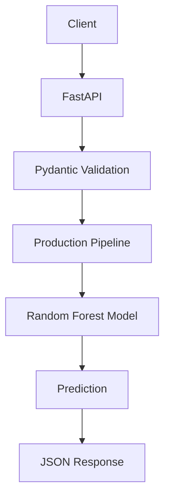
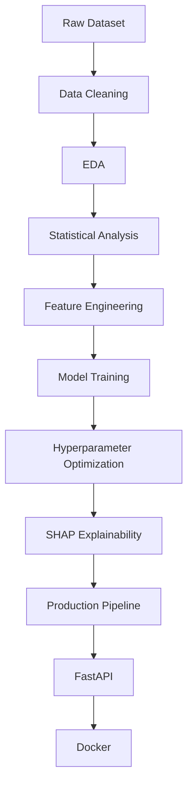
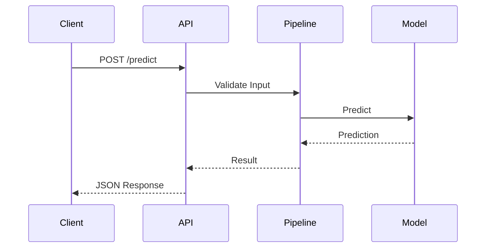

<div align="center">

# 🚖 NYC Yellow Taxi Trip Duration Prediction

### End-to-End Machine Learning Engineering Project

*A complete production-ready machine learning system for predicting NYC taxi trip duration using statistical analysis, feature engineering, model explainability, FastAPI, and Docker.*

<br>


<br>


</div>

---

# 📑 Table of Contents

- [📌 Project Overview](#-project-overview)
- [🎯 Business Problem](#-business-problem)
- [💼 Business Value](#-business-value)
- [⭐ Project Highlights](#-project-highlights)
- [📂 Dataset](#-dataset)
- [📊 Dataset Overview](#-dataset-overview)
- [🏗 Repository Structure](#-repository-structure)
- [🛠 Technology Stack](#-technology-stack)
- [📈 Exploratory Data Analysis](#-exploratory-data-analysis)
- [📉 Statistical Analysis](#-statistical-analysis)
- [⚙ Feature Engineering](#-feature-engineering)
- [🤖 Machine Learning Models](#-machine-learning-models)
- [🏆 Final Production Model](#-final-production-model)
- [📊 Model Performance](#-model-performance)
- [🔍 Model Explainability](#-model-explainability)
- [🏭 Production Pipeline](#-production-pipeline)
- [🚀 REST API](#-rest-api)
- [🐳 Docker Deployment](#-docker-deployment)
- [📖 API Documentation](#-api-documentation)
- [⚡ Prediction Workflow](#-prediction-workflow)
- [💾 Installation](#-installation)
- [▶ Running the Project](#-running-the-project)
- [📷 Results](#-results)
- [📚 Lessons Learned](#-lessons-learned)
- [🚀 Future Improvements](#-future-improvements)
- [👨‍💻 Author](#-author)
- [📄 License](#-license)

---

# 📌 Project Overview

This project was developed as a complete **Machine Learning Engineering** project rather than a traditional notebook-based machine learning solution.

The objective is to accurately predict the duration of New York City yellow taxi trips using historical trip information while demonstrating the complete lifecycle of building, evaluating, deploying, and serving a production-ready regression model.

Unlike many machine learning repositories that stop after model training, this project continues through every stage required in a real production environment—from raw data preprocessing to a deployable REST API running inside a Docker container.

Throughout this project, the complete engineering workflow was implemented, including:

- Business Understanding
- Data Cleaning & Validation
- Exploratory Data Analysis (EDA)
- Statistical Analysis
- Feature Engineering
- Regression Modeling
- Model Evaluation
- Hyperparameter Optimization
- Feature Importance Analysis
- SHAP Explainability
- Production Pipeline Construction
- Model Serialization
- REST API Development
- Input Validation
- Logging
- Exception Handling
- Docker Deployment
- Interactive Swagger Documentation

The final outcome is a reusable, scalable, and production-ready machine learning system suitable for deployment and portfolio presentation.

---

# 🎯 Business Problem

Trip duration prediction plays a critical role in modern transportation systems.

Accurate travel time estimation directly affects both customer satisfaction and operational efficiency.

Taxi companies and ride-sharing platforms rely heavily on travel time prediction for:

- Estimated Time of Arrival (ETA)
- Driver Allocation
- Fleet Optimization
- Dynamic Pricing
- Route Planning
- Customer Experience
- Operational Cost Reduction

The goal of this project is to build a regression model capable of estimating taxi trip duration with high accuracy while maintaining interpretability and production readiness.

---

# 💼 Business Value

A reliable trip duration prediction system provides value across multiple stakeholders.

### 🚖 For Taxi Companies

- Better fleet utilization
- Reduced idle time
- More efficient dispatching
- Increased operational efficiency

---

### 👨‍✈️ For Drivers

- Better trip planning
- Reduced waiting time
- Improved daily scheduling

---

### 👤 For Customers

- More accurate ETAs
- Improved ride experience
- Better trust in the platform

---

### 📊 For Business Analysts

- Demand forecasting
- Traffic pattern analysis
- Performance monitoring
- Service optimization

---

# ⭐ Project Highlights

This repository demonstrates the implementation of a complete Machine Learning Engineering workflow.

✔ End-to-End Regression Project

✔ Production Machine Learning Pipeline

✔ Comprehensive Exploratory Data Analysis

✔ Statistical Inference & Hypothesis Testing

✔ Advanced Feature Engineering

✔ Multiple Regression Models

✔ Hyperparameter Optimization

✔ Feature Importance Analysis

✔ SHAP Explainability

✔ Production Serialization

✔ FastAPI REST API

✔ Request Validation with Pydantic

✔ Production Logging

✔ Exception Handling

✔ Docker Deployment

✔ Interactive Swagger Documentation

✔ Portfolio-Ready Project

---

# 📂 Dataset

The project uses the **NYC Yellow Taxi Trip Records** dataset.

The dataset contains millions of taxi trips collected from New York City's Taxi & Limousine Commission (TLC).

Each trip includes spatial, temporal, and operational information describing the taxi ride.

The objective is to predict the trip duration using historical trip characteristics.

---

## Dataset Features

The dataset includes features such as:

- VendorID
- Passenger Count
- Trip Distance
- Pickup Datetime
- Dropoff Datetime
- Pickup Latitude
- Pickup Longitude
- Dropoff Latitude
- Dropoff Longitude
- RateCodeID
- Payment Type
- Store and Forward Flag

Additional engineered temporal features were created during preprocessing.

---

## Target Variable

The prediction target is:

```text
Trip Duration (minutes)
```

This is treated as a supervised regression problem.

---

# 📊 Dataset Overview

| Property | Value |
|----------|-------|
| Problem Type | Supervised Regression |
| Domain | Transportation Analytics |
| Dataset | NYC Yellow Taxi Trips |
| Target | Trip Duration |
| ML Task | Regression |
| Explainability | SHAP |
| Deployment | FastAPI + Docker |

---

## Data Processing Pipeline

The raw dataset undergoes several preprocessing stages before model training.

```
Raw Dataset
      │
      ▼
Data Cleaning
      │
      ▼
Missing Value Handling
      │
      ▼
Outlier Treatment
      │
      ▼
Feature Engineering
      │
      ▼
Model Training
```

---

# 🏗 Repository Structure

```text
NYC-Yellow-Taxi-Trip-Duration-Prediction/

├── app/
│   ├── main.py
│   ├── predictor.py
│   ├── schemas.py
│   ├── logger.py
│   └── config.py
│
├── artifacts/
│   ├── feature_names.pkl
│   ├── metadata.json
│   └── metrics.json
│
├── assets/
│   ├── images/
│   └── diagrams/
│
├── data/
│
├── logs/
│
├── models/
│   └── production_pipeline.pkl
│
├── notebooks/
│   └── nyc_taxi_trip_duration_prediction.ipynb
│
├── reports/
│
├── src/
│   ├── preprocessing.py
│   ├── training.py
│   ├── evaluation.py
│   ├── explainability.py
│   ├── inference.py
│   └── utils.py
│
├── tests/
│
├── Dockerfile
├── requirements.txt
├── README.md
└── LICENSE
```

---

# 🛠 Technology Stack

## Programming

- Python

## Data Analysis

- Pandas
- NumPy

## Visualization

- Matplotlib

## Machine Learning

- Scikit-Learn

## Explainability

- SHAP

## Model Serialization

- Joblib

## API Development

- FastAPI
- Pydantic

## Deployment

- Docker
- Uvicorn

## Development

- Git
- GitHub
- Jupyter Notebook

---

# 📈 Exploratory Data Analysis

Exploratory Data Analysis (EDA) was performed to understand the structure, quality, and behavior of the NYC Yellow Taxi dataset before model development.

Rather than immediately training a regression model, the project focused on discovering hidden patterns, identifying anomalies, and validating assumptions about the data.

The analysis covered:

- Dataset structure inspection
- Data types verification
- Missing value analysis
- Duplicate detection
- Distribution analysis
- Correlation analysis
- Temporal analysis
- Geographic distribution
- Outlier detection

---

## Key Findings

### Trip Duration Distribution

The target variable exhibited a highly right-skewed distribution.

Most taxi trips were relatively short, while a very small percentage represented unusually long journeys.

This observation justified:

- Outlier investigation
- Robust evaluation metrics
- Careful interpretation of prediction errors

---

### Trip Distance

Trip distance showed one of the strongest positive relationships with trip duration.

As expected:

- Longer trips generally required more travel time.
- Extremely long distances often corresponded to higher prediction uncertainty.

---

### Temporal Patterns

Temporal analysis revealed noticeable demand variations across:

- Hours of the day
- Days of the week
- Months

Rush-hour periods consistently produced longer average trip durations due to traffic congestion.

---

### Missing Values

The cleaned dataset contained no critical missing values after preprocessing.

Data quality checks ensured consistency before model training.

---

### Outliers

Several extreme observations were detected.

Examples included:

- Unrealistically long trips
- Extremely short trips
- Abnormal travel distances

Instead of blindly removing all outliers, they were carefully analyzed to distinguish between legitimate observations and data anomalies.

---

## Visualizations

The notebook includes:

- Target Distribution
- Trip Distance Distribution
- Correlation Heatmap
- Hourly Demand Analysis
- Weekly Demand Analysis
- Monthly Demand Analysis
- Scatter Plots
- Box Plots
- Histogram Analysis

---

# 📉 Statistical Analysis

Beyond traditional exploratory analysis, this project incorporated statistical methods to better understand the underlying characteristics of the data.

The objective was not only to build an accurate model but also to validate assumptions using statistical reasoning.

---

## Topics Covered

The statistical analysis included:

- Probability Theory
- Conditional Probability
- Joint Probability
- Marginal Probability
- Bayes' Theorem
- Sampling
- Sampling Distribution
- Central Limit Theorem
- Confidence Intervals
- Hypothesis Testing
- Correlation Analysis
- Covariance Analysis

---

## Confidence Intervals

Confidence intervals were used to estimate population statistics while accounting for sampling uncertainty.

Rather than relying on single-point estimates, interval estimation provided a more realistic representation of uncertainty.

---

## Hypothesis Testing

Hypothesis testing was applied to investigate whether observed differences in trip characteristics were statistically significant.

The project introduced concepts including:

- Null Hypothesis
- Alternative Hypothesis
- Test Statistics
- P-values
- Statistical Significance

---

## Business Perspective

Statistical analysis helps distinguish genuine business patterns from random fluctuations.

This improves confidence in model development and supports evidence-based decision making.

---

# ⚙️ Feature Engineering

Feature engineering played a central role in improving predictive performance.

Raw taxi records were transformed into informative numerical features that better captured temporal and operational behavior.

---

## Engineered Features

Temporal features:

- Pickup Hour
- Pickup Weekday
- Pickup Week
- Pickup Month

Operational features:

- Passenger Count
- VendorID
- RateCodeID

Spatial features:

- Pickup Latitude
- Pickup Longitude

Target:

- Trip Duration

---

## Why Feature Engineering Matters

Machine learning models rely heavily on feature quality.

Well-designed features often contribute more to predictive performance than choosing increasingly complex algorithms.

---

## Engineering Decisions

Several design principles guided feature creation:

- Avoid data leakage
- Preserve interpretability
- Keep preprocessing reproducible
- Maintain compatibility with the production pipeline

---

# 🤖 Machine Learning Models

Several regression algorithms were evaluated throughout the project.

Each model served a different purpose during experimentation.

---

## Linear Regression

Used as the baseline model.

Advantages:

- Fast
- Highly interpretable
- Establishes a performance benchmark

Limitations:

- Assumes linear relationships
- Limited capacity for nonlinear patterns

---

## Decision Tree Regressor

Introduced nonlinear decision boundaries.

Advantages:

- Easy to interpret
- Captures nonlinear relationships

Limitations:

- High variance
- Sensitive to overfitting

---

## Random Forest Regressor

The final production model.

Advantages:

- Strong predictive performance
- Robust against overfitting
- Handles nonlinear interactions
- Stable across different datasets

---

# 📊 Model Performance

The following table summarizes the performance of the main regression models evaluated throughout the project.

| Model | MAE ↓ | RMSE ↓ | R² ↑ | Status |
|--------|------:|-------:|------:|:------:|
| Linear Regression | 3.828 | 5.519 | 0.628 | Baseline |
| Decision Tree | 2.637 | 4.114 | 0.793 | Tuned |
| Random Forest | **2.496** | **3.893** | **0.815** | 🏆 Production |

---

## Performance Improvement

| Model Evolution | MAE Improvement | RMSE Improvement | R² Improvement |
|-----------------|---------------:|-----------------:|---------------:|
| Linear Regression → Decision Tree | **31.1% ↓** | **25.5% ↓** | **+26.3%** |
| Decision Tree → Random Forest | **5.3% ↓** | **5.4% ↓** | **+2.7%** |
| Linear Regression → Random Forest | **34.8% ↓** | **29.5% ↓** | **+29.8%** |

---

## Final Production Model

🏆 **Random Forest Regressor (Final)**

| Metric | Value |
|--------|------:|
| MAE | **2.496413** |
| RMSE | **3.893483** |
| R² Score | **0.814663** |
| Training Time | **270.36 sec** |

---

## 📊 Complete Benchmark Results

| Rank | Model | MAE ↓ | RMSE ↓ | R² ↑ | Training Time (sec) | Status |
|-----:|--------|------:|-------:|------:|--------------------:|:------:|
| 🥇 1 | Random Forest (Final) | **2.496413** | **3.893483** | **0.814663** | 270.36 | 🚀 Production |
| 🥈 2 | Random Forest (Baseline) | 2.601847 | 4.057575 | 0.798712 | 101.01 | Baseline |
| 🥉 3 | Decision Tree (Tuned) | 2.636622 | 4.114148 | 0.793060 | 58.99 | Tuned |
| 4 | Decision Tree (Default) | 3.504377 | 5.506155 | 0.629334 | 92.85 | Initial |
| 5 | Linear Regression | 3.828084 | 5.519339 | 0.627557 | **2.79** | Baseline |

The optimized Random Forest model achieved the best overall balance between prediction accuracy, robustness, and generalization. It was therefore selected as the final production model and integrated into the deployment pipeline.

---

# 🏆 Final Production Model

After evaluating multiple regression algorithms and performing hyperparameter optimization, the **Random Forest Regressor** was selected as the final production model.

The selection was not based solely on achieving the highest R² score. Instead, the model was chosen after evaluating multiple engineering factors, including predictive accuracy, robustness, interpretability, computational cost, and deployment suitability.

---

## Final Metrics

| Metric | Value |
|---------|------:|
| Model | Random Forest Regressor |
| MAE | **2.496413** |
| RMSE | **3.893483** |
| R² Score | **0.814663** |
| Training Time | **270.36 sec** |

---

## Why Random Forest?

The Random Forest model consistently outperformed the baseline models while maintaining strong generalization capabilities.

### Key Advantages

- Lowest MAE
- Lowest RMSE
- Highest R² Score
- Excellent robustness against overfitting
- Handles nonlinear feature interactions effectively
- Requires minimal feature scaling
- Stable performance across validation data
- Suitable for production deployment

---

## Engineering Decision

Although Linear Regression trained almost instantly and Decision Trees provided good interpretability, Random Forest offered the best balance between:

- Prediction Accuracy
- Generalization
- Robustness
- Maintainability
- Deployment Readiness

Therefore, it was selected as the production model used throughout the deployment pipeline.

---

# 🔍 Model Explainability

One of the major goals of this project was to ensure that the final model was not treated as a "black box".

To improve transparency and trust, SHAP (SHapley Additive Explanations) was used to explain how each feature contributed to the model's predictions.

---

## Explainability Workflow

```text
Trained Random Forest
          │
          ▼
TreeExplainer
          │
          ▼
SHAP Values
          │
          ▼
Global Feature Importance
          │
          ▼
Local Prediction Explanation
```

---

## Explainability Objectives

The SHAP analysis was performed to answer several key questions:

- Which features influence predictions the most?
- Which features increase predicted trip duration?
- Which features decrease predicted trip duration?
- How do features interact with each other?
- Can individual predictions be explained?

---

## SHAP Visualizations

The notebook includes the following explainability visualizations:

- SHAP Summary Plot
- SHAP Beeswarm Plot
- SHAP Dependence Plot
- Feature Importance Bar Plot

---

## Business Benefits

Model explainability provides several advantages:

- Increased stakeholder trust
- Easier model validation
- Better debugging
- Regulatory transparency
- Improved business understanding

---

# 🏭 Production Pipeline

Instead of manually preprocessing incoming data before prediction, a reusable Scikit-learn Pipeline was created.

This ensures that every prediction follows exactly the same preprocessing steps used during model training.

---

## Pipeline Components

```text
Raw Input
      │
      ▼
Feature Validation
      │
      ▼
Column Transformer
      │
      ▼
Preprocessing
      │
      ▼
Random Forest Model
      │
      ▼
Prediction
```

---

## Benefits of Using a Pipeline

- Prevents training-serving skew
- Eliminates preprocessing inconsistencies
- Simplifies deployment
- Reduces production bugs
- Improves maintainability
- Enables model serialization

---

## Serialized Artifacts

The following production artifacts are generated after training:

```text
models/
    production_pipeline.pkl

artifacts/
    feature_names.pkl
    metadata.json
    metrics.json
```

---

## Pipeline Metrics

| Metric | Value |
|---------|------:|
| MAE | **2.496413** |
| RMSE | **3.893483** |
| R² Score | **0.814663** |

The serialized pipeline can be loaded directly without retraining the model.

---

# 🏗 System Architecture



---

# 🔄 Machine Learning Workflow



---

# ⚡ Prediction Workflow



---

# 📌 Key Engineering Decisions

Several engineering decisions were made throughout the project to improve maintainability and production readiness.

| Decision | Reason |
|----------|--------|
| Removed leakage features | Prevent unrealistic model performance |
| Used Train / Validation / Test split | Reliable model evaluation |
| Built reusable Pipeline | Consistent preprocessing |
| Serialized the Pipeline | Easy deployment |
| Used SHAP | Explainability |
| Developed REST API | Production inference |
| Added Logging | Easier debugging |
| Added Error Handling | Robust API behavior |
| Dockerized the application | Environment consistency |

---

# 🚀 REST API

To make the trained model accessible outside the notebook environment, a production-ready REST API was developed using **FastAPI**.

The API allows external applications to send trip information and receive predicted trip durations in real time.

The deployment architecture follows modern Machine Learning Engineering practices and separates inference logic from model training.

---

## API Features

- RESTful API Design
- Automatic Request Validation
- Structured JSON Responses
- Production Logging
- Exception Handling
- Interactive Swagger Documentation
- OpenAPI Specification
- Production Pipeline Integration

---

# 📡 Available Endpoints

| Method | Endpoint | Description |
|---------|----------|-------------|
| GET | `/` | Welcome endpoint |
| GET | `/health` | API health status |
| POST | `/predict` | Predict trip duration |

---

# 📝 Request Example

```json
{
  "VendorID": 2,
  "passenger_count": 1,
  "trip_distance": 3.7,
  "pickup_hour": 17,
  "pickup_weekday": 4,
  "pickup_month": 8,
  "RateCodeID": 1
}
```

---

# ✅ Response Example

```json
{
  "predicted_trip_duration": 14.87
}
```

---

# ❌ Validation Errors

FastAPI and Pydantic automatically validate incoming requests.

Examples include:

- Missing required fields
- Invalid data types
- Negative trip distance
- Invalid categorical values

The API returns meaningful HTTP status codes and descriptive error messages to simplify debugging.

---

# ❤️ Health Check

```http
GET /health
```

Example Response

```json
{
    "status": "healthy",
    "model_loaded": true
}
```

---

# 📖 Interactive API Documentation

FastAPI automatically generates interactive documentation.

After running the application, open:

```text
http://127.0.0.1:8000/docs
```

Swagger UI provides:

- Endpoint exploration
- Live testing
- Request schema
- Response schema
- Validation messages

---

# 🐳 Docker Deployment

The application is fully containerized using Docker, ensuring consistent behavior across different environments.

---

## Build Image

```bash
docker build -t nyc-taxi-api .
```

---

## Run Container

```bash
docker run -d \
-p 8000:8000 \
--name nyc-taxi-api \
nyc-taxi-api
```

---

## Verify Running Container

```bash
docker ps
```

---

## Stop Container

```bash
docker stop nyc-taxi-api
```

---

## Remove Container

```bash
docker rm nyc-taxi-api
```

---

# 💾 Installation

Clone the repository:

```bash
git clone https://github.com/morsycoo/NYC-Yellow-Taxi-Trip-Duration-Prediction.git

cd NYC-Yellow-Taxi-Trip-Duration-Prediction
```

---

Install dependencies:

```bash
pip install -r requirements.txt
```

---

# ▶ Running the Project

Start the API locally:

```bash
uvicorn app.main:app --reload
```

The API will be available at:

```text
http://127.0.0.1:8000
```

---

# 📂 Project Outputs

Running the project generates several reusable artifacts.

```text
models/
│
└── production_pipeline.pkl

artifacts/
│
├── feature_names.pkl
├── metadata.json
└── metrics.json

logs/
│
└── api.log
```

---

# 📸 Project Results

The repository contains visualizations generated during the analysis and modeling stages.

Recommended screenshots include:

- Target Distribution
- Correlation Heatmap
- Feature Importance
- SHAP Summary Plot
- Residual Analysis
- Actual vs Predicted
- Swagger UI
- Docker Container Running

Repository structure:

```text
assets/
└── images/
    ├── target_distribution.png
    ├── correlation_heatmap.png
    ├── feature_importance.png
    ├── shap_summary.png
    ├── residual_plot.png
    ├── actual_vs_predicted.png
    ├── swagger_ui.png
    └── docker_running.png
```

---

# 🧪 Testing

The API was tested using:

- Swagger UI
- FastAPI Test Client
- Manual JSON Requests

Validation confirmed:

- Successful prediction requests
- Proper validation errors
- Correct HTTP status codes
- Consistent JSON responses

---

# ⚙ Configuration

The project uses a centralized configuration module.

Configuration includes:

- Model paths
- Logging configuration
- API metadata
- Serialization paths

Keeping configuration separate from application logic simplifies maintenance and deployment.

---

# 🔐 Error Handling

Production-grade exception handling was implemented to improve reliability.

Handled scenarios include:

- Missing model files
- Invalid requests
- Pipeline loading failures
- Unexpected runtime exceptions

Errors are logged automatically while clients receive meaningful HTTP responses.

---

# 📋 Deployment Checklist

| Task | Status |
|------|:------:|
| Production Pipeline | ✅ |
| Model Serialization | ✅ |
| FastAPI | ✅ |
| Request Validation | ✅ |
| Logging | ✅ |
| Error Handling | ✅ |
| Swagger | ✅ |
| Docker | ✅ |
| API Testing | ✅ |

---

# 📊 Project Summary

This project demonstrates the complete lifecycle of building and deploying a Machine Learning solution.

Starting from raw NYC taxi trip records, the project progresses through data preprocessing, exploratory analysis, statistical reasoning, feature engineering, regression modeling, explainability, production deployment, and API development.

Unlike many notebook-only projects, this repository emphasizes reproducibility, maintainability, and production readiness.

---

# 🏆 Key Achievements

✅ End-to-End Machine Learning Project

✅ Business Problem Formulation

✅ Data Cleaning & Validation

✅ Exploratory Data Analysis (EDA)

✅ Statistical Analysis

✅ Feature Engineering

✅ Multiple Regression Models

✅ Hyperparameter Optimization

✅ Model Benchmarking

✅ Feature Importance Analysis

✅ SHAP Explainability

✅ Residual Analysis

✅ Prediction Error Investigation

✅ Production Pipeline

✅ Model Serialization

✅ FastAPI REST API

✅ Request Validation using Pydantic

✅ Structured Logging

✅ Exception Handling

✅ Docker Deployment

✅ Interactive Swagger Documentation

---

# 📚 Lessons Learned

Developing this project reinforced several important Machine Learning Engineering principles.

### Data Quality Matters More Than Model Complexity

A carefully cleaned and validated dataset often contributes more to model performance than simply switching to a more complex algorithm.

---

### Feature Engineering Is Critical

Well-designed features significantly improved predictive performance and provided more meaningful inputs to the learning algorithms.

---

### Model Evaluation Should Be Comprehensive

Selecting a model based on a single metric can be misleading.

Multiple evaluation metrics, validation strategies, and error analyses provide a much more reliable assessment.

---

### Explainability Builds Trust

Using SHAP transformed the model from a black box into an interpretable system, making predictions easier to understand and validate.

---

### Production Thinking Changes Everything

Building an accurate model is only one part of a real-world machine learning project.

Deployment, reproducibility, logging, validation, and maintainability are equally important.

---

# 🚀 Future Improvements

Potential enhancements include:

- Gradient Boosting (XGBoost / LightGBM / CatBoost)
- Bayesian Hyperparameter Optimization
- Real-Time Traffic Data Integration
- Weather-Based Features
- Geographic Distance Features
- GPS Route Features
- Time-Series Traffic Modeling
- MLflow Experiment Tracking
- Unit & Integration Testing
- CI/CD Pipeline
- Kubernetes Deployment
- Cloud Deployment (AWS, Azure, GCP)
- Model Monitoring
- Drift Detection
- Automated Retraining
- Batch Prediction Service
- Streaming Prediction API

---

# 💡 Engineering Takeaways

This project demonstrates practical experience with:

- Machine Learning Engineering
- Regression Modeling
- Statistical Analysis
- Feature Engineering
- Explainable AI (XAI)
- Production Pipelines
- REST API Development
- Docker
- Software Engineering Best Practices

---

# 🎤 Interview Talking Points

This project can be discussed from multiple perspectives during technical interviews.

### Business Perspective

- Why trip duration prediction matters
- Business impact of accurate ETA estimation
- Fleet optimization
- Customer satisfaction

---

### Machine Learning Perspective

- Why Regression?
- Why Random Forest?
- Why SHAP?
- Why multiple evaluation metrics?
- Why hyperparameter tuning?

---

### Engineering Perspective

- Why use a Pipeline?
- Why serialize the model?
- Why FastAPI?
- Why Docker?
- Why logging?
- Why validation?
- Why separate training from inference?

---

### Production Perspective

- Handling invalid requests
- Preventing data leakage
- Ensuring reproducibility
- Deployment consistency
- API scalability

---

# 🎯 Skills Demonstrated

This project showcases proficiency in:

| Category | Skills |
|----------|--------|
| Programming | Python |
| Data Analysis | Pandas, NumPy |
| Visualization | Matplotlib |
| Statistics | Probability, Hypothesis Testing, Confidence Intervals |
| Machine Learning | Scikit-Learn |
| Explainability | SHAP |
| API Development | FastAPI |
| Validation | Pydantic |
| Deployment | Docker |
| Serialization | Joblib |
| Documentation | Markdown |
| Version Control | Git & GitHub |

---

# 📈 Career Relevance

This repository demonstrates practical skills expected from:

- Machine Learning Engineer
- Data Scientist
- Applied AI Engineer
- AI Engineer
- MLOps Engineer (Foundational Level)

---

# 🤝 Contributing

Contributions are welcome.

If you have suggestions for improving the project, feel free to:

1. Fork the repository.
2. Create a feature branch.
3. Commit your changes.
4. Open a Pull Request.

Constructive feedback and discussions are always appreciated.

---

# 👨‍💻 Author

## Mahmoud Morsy

Machine Learning Engineer | AI Engineer

Passionate about building production-ready Machine Learning systems that combine statistical rigor, explainability, and scalable deployment.

### Connect with me

- GitHub: https://github.com/morsycoo
- LinkedIn: https://linkedin.com/in/mahmudmursi
- Kaggle: https://kaggle.com/mahmoudmorsy

---

# 🙏 Acknowledgments

Special thanks to:

- NYC Taxi & Limousine Commission (TLC) for providing the dataset.
- The open-source community behind:
  - Scikit-Learn
  - FastAPI
  - SHAP
  - Pandas
  - NumPy
  - Docker

---

# 📄 License

This project is licensed under the MIT License.

Feel free to use this repository for educational and research purposes.

---

<div align="center">

### ⭐ If you found this project useful, consider giving it a Star on GitHub!

**Happy Learning! 🚀**

</div>